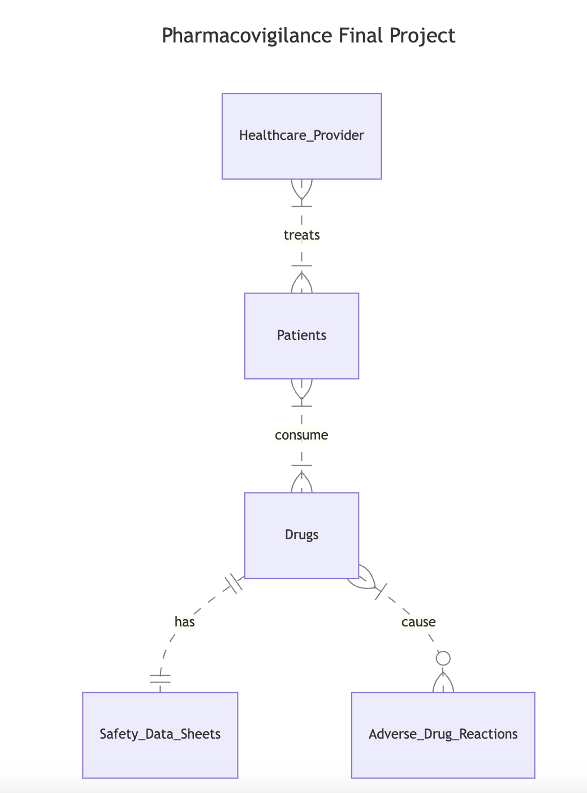

# Design Document

"PharmaCare Insight"

By Kristy Mendoza Rangel

Description: This is my final project for the course CS50: Introduction to Databases with SQL. 

Video overview: <https://youtu.be/t3qO8ZwM29s?si=9uUGCDLWcYYIZQ_f>

## Scope

* The purpose of this database is to outline an effective way to collect and analyze pharmacovigilance data and track adverse drugs reactions while also keeping safety profiles to aid in solutions.

* In the database, there is a focus on drugs that were developed by our pharmaceutical company that are currently in Phase IV of clinical trials as part of the post-marketing surveillance. It includes patient demographics that have been prescribed a Phase IV drug by their health care provided as well as any adverse events occurring due to the drugs. There is also a table providing more information about the drug and risks and side effects associated with them as concluded by the trial. Furthermore, there is table summarizing the information of each drug such as their brand name and release date. Finally, there is information on the healthcare providers that are prescribing the drugs.

* Outside of the scope would be drugs that are currently in Phases 1, 2, or 3 of clinical trials as well as drugs that were not created by the current company. Furthermore, there will only be information from patients that responded negatively to the drug and not positively.

## Functional Requirements

A user will be able to perform a range of quering with this database design. It supports a wide range of tasks and functionalities related to pharmaceutical data management, patient care, and drug safety monitoring, providing users with the tools needed to efficiently manage and analyze critical healthcare information. They are able to analyze the drug effects of a Phase IV drug and how it has affected the general population as well as understand the safety and risk information of each drug.

## Representation

### Entities

#### Patients

The `patients` table includes:

* `id`, which specifies the unique ID for the patient as an `INTEGER`. This column has the `PRIMARY KEY` constraint applied.
* `first_name`, which specifies the patients's first name as `TEXT`, given `TEXT` is appropriate for name fields.
* `middle_initial`, which specifies the patient's middle inital as `TEXT`, given `TEXT` is for name fields.
* `last_name`, which specifies the patients's last name. `TEXT` is used for the same reason as `first_name` and `middle_initial`.
* `sex`, which specifies the patients's sex for demographic purposes. `TEXT` is used since the approapite values of `male` and `female` are text entities. A `CHECK` constraint ensures that there can only be 2 possible entries for the `sex` column.
* `date_of_birth`, which specifies when the patient was born for age and demographic purposes. Timestamps in SQLite can be conveniently stored as `NUMERIC`.

All columns in this table are also faced with a `NOT NULL` constraint, making everything required except for the column `middle_intial` in which we take into account that not all patients will hace a middle name.

#### Healthcare_Providers

The `healthcare_providers` table includes:

* `id`, which specifies the unique ID for the healthcare provider as an `INTEGER`. This column has the `PRIMARY KEY` constraint applied.
* `first_name`, which specifies the provider's first name as `TEXT`.
* `last_name`, which specifies provider's last name as `TEXT`.
* `specialty`, which specifies the speacialty of the doctor as `TEXT`.
* `practice_name`, which specifies the name of the practice or hospital that the doctor works in as `TEXT`.

All columns in this table are also specified with `NOT NULL` constraint, making all columns required.

#### Drugs

The `drugs` table includes:

* `id`, which specifies the unique ID for the drug as an `INTEGER`. This column has the `PRIMARY KEY` constraint applied.
* `generic_name`, which specifies the generic name of the drug developed as a `TEXT`.
* `brand_name`, which specifies the brand name of the drug that is being sold as, specified by `TEXT`.
* `release_date`, which specifies the date when the drug was sold to the public as `NUMERIC`.
* `condition_treated`, which specifies the condition that the drug treats as `TEXT`.

All columns in this table are also specified with `NOT NULL` constraint, making all columns required.

#### Prescriptions

The `prescriptions` table includes:

* `id`, which specifies the unique ID for the prescription as an `INTEGER`. This column has the `PRIMARY KEY` constraint applied.
* `patient_id`, which is the ID of the patient who was prescribed the drug as an `INTEGER`. This column thus has the `FOREIGN KEY` constraint applied, referencing the `id` column in the `patiens` table to ensure data integrity.
* `healthcare_provider_id`, which is the ID of the healthcare provider who made the prescription as an `INTEGER`. This column thus has the `FOREIGN KEY` constraint applied, referencing the `id` column in the `healthcare_providers` table.
* `drug_id`, which is the ID of the drug that was prescribed as an `INTEGER`. This column thus has the `FOREIGN KEY` constraint applied, referencing the `id` column in the `drug` table.
* `date`, which specifies the date of the prescription as `NUMERIC`.

All columns in this table are also specified with `NOT NULL` constraint, making all columns required.

#### Averse_Drug_Reactions

The `averse_drug_reactions` table includes:

* `id`, which specifies the unique ID for the drug reaction as an `INTEGER`. This column has the `PRIMARY KEY` constraint applied.
* `patient_id`, which is the ID of the patient who was prescribed the drug as an `INTEGER`. This column thus has the `FOREIGN KEY` constraint applied, referencing the `id` column in the `patiens` table to ensure data integrity.
* `drug_id`, which is the ID of the drug that was prescribed as an `INTEGER`. This column thus has the `FOREIGN KEY` constraint applied, referencing the `id` column in the `drug` table.
* `report_date`, which specifies the date that the reaction was reported as `NUMERIC`.
* `reaction_type`, which specifies the type of reaction to the drug that was experienced by the patient as `TEXT`.
* `severity`, which specifies the severity of the reaction as `TEXT` and has a `CHECK` constraint to ensure that the column only takes in `mild`, `moderate` and `severe` inputs.
* `outcome`, which specifies the current outcome of the reactions as `TEXT` and has a `CHECK` constraint to ensure that the column only takes in `recovering`, `recovered`, `fatal` inputs.

All columns in this table are also specified with `NOT NULL` constraint, making all columns required.

#### Safety_Data_Sheets

The `safety_data_sheets` table includes:

* `id`, which specifies the unique ID for the safety data sheet of the drug as an `INTEGER`. This column has the `PRIMARY KEY` constraint applied.
* `drug_id`, which is the ID of the drug that was prescribed as an `INTEGER`. This column thus has the `FOREIGN KEY` constraint applied, referencing the `id` column in the `drug` table.
* `warnings_precautions`, which specifies the precautions that need to be taken when consuming this drug as `TEXT`.
* `emergency_procedures`, which specifies the procedures that need to be taken in the case of an emergency caused by the drug as `TEXT`.

All columns in this table are also specified with `NOT NULL` constraint, making all columns required.

### Relationships

The ER Diagram details the following:

* A healthcare provider can treat one to many patients, and a patient can be treated by one to many healthcare providers.
* A patient can consume one to many drugs and a drug can be consumed by one to many patients.
* A drug can only have one safety data sheet. A safety data sheet can only belong to one drug.
* A drug can cause zero to many averse drug reactions, and an averse drug reaction can be caused by one to many drugs.

## Optimizations

* The index `idx_prescriptions_patient_id` was created on the prescriptions table because there will be frequent queries that involve searching for prescriptions based on patient_id. This index will speed up such queries by allowing the database to quickly locate all prescriptions associated with a specific patient.

* The index `idx_prescriptions_drug_id` was created on the prescriptions table because queries involving filtering or joining prescriptions based on drug_id will benefit from this index. It enhances the performance of queries that retrieve prescriptions for a specific drug.

* The index `idx_drug_id` was created on the averse_drug_reactions table because queries related to adverse drug reactions often involve filtering or joining reactions based on the drug involved. This index speeds up such queries by facilitating quick access to adverse reactions associated with a specific drug.

## Limitations

This design does not take into an account how a drug can treat multiple conditions and rather it focuses on only a single disease that it can be used for.

