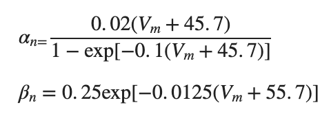

# Exploring the Role of A-Type Potassium Current in Neuronal Excitability: A Connor-Stevens Model Experiment
##### By Kristy Mendoza Rangel
##### Date: November 2023
##### Course: Fundamentals in Computational Neuroscience [NSBV BC2004]


## Abstract 

The Connor-Stevens Model introduces a unique element with the inclusion of an A-type current, characterized as a transient potassium conductance regulated by two gating variables, a and b. The model summary's steady-state gating variables underscore that the A-type current is concurrently active with the sodium current. The objective of this experiment was to investigate the neuron's response and behavior in the presence of varied A-type current configurations. Specifically, we sought to understand the role played by the A-type current in shaping the action potential and its interaction with sodium, a known ion that induces depolarization in the neuron. To do this, the maximal A_type conductance is manipulated since it is synonymous with the current and the amount of A-type channels in the membrane. In addition to constructing a voltage trace for our control experiment, featuring a maximal A-type K+ conductance of 4700 nS, we generated voltage traces using variable maximal A-type K+ conductances: 3500, 4300, 4700, 4800, and 4900 nS. We calculated the number of spikes, firing rate, and depolarization time for the first spike for each of the voltage traces to comprehend the action potential behavior of the Connor-Stevens model with varied maximal A-type K+ conductance. Our results did align with our original hypothesis that A-type current acts as an inhibitor to neuron excitability, as there was an increase in spikes, firing rate, and a decrease in depolarization time when decreasing the maximal A-type K+ conductance. The opposite was observed when we increased the maximal A-type conductance in relation to the control experiment.

## Model Summary

The Connor-Stevens model is very similar to the Hodgkin-Huxley model however, this model includes an A-type current. The differential equation that illustrates the Connor-Stevens model is 


What is novel about this model is the short and brief action potential, which is primarily caused by the input of the A-current. Governed by activation and deactivation processes via gating variables a and b, where a activates A-type potassium, and b is associated with its inactivation. Despite being potassium-dependent, the A-current has a reversal potential of -75 mV, slightly lower than that of potassium. Despite its potassium dependence, the A-type current exhibits a reversal potential of -75 mV, slightly lower than the reversal potential of potassium. In this model, we employ time constants that also describe the ion channel kinetics: 


which τ is in units of ms and 𝑉𝑚 in units of mV. The steady-state gating variables for the A-current are calculated accordingly:


These steady-state gating variables describe the long-term or equilibrium behavior of ion channel gates a and b in response to a constant membrane potential. They provide information about the proportion of ion channels in the open or closed state once the system has reached a stable condition. The A-type conductance, operating as a potassium conductance, exhibits significant activation, countering the effects of the sodium current. This phenomenon is evident in Figure 2, where the plot illustrates the concurrent activation of the a and m gates. At hyperpolarizing voltages, the steady state of the a gate remains high but increases with membrane potential. Conversely, the steady state of the b gate, starting low (0.2) at negative voltages, decreases with increased voltage.


It also contains sodium and potassium currents, however, they have faster kinetics so action potentials are shorter. As in the Hodgkin and Huxley model, sodium is the primary ion responsible for depolarizing the membrane as it allows sodium ions to flow into the cell. It has fast kinetics as explained
by the following rate constants for its m and h gates:


The m gate is associated with the activation of the sodium channel, while the h gate is associated with the inactivation of the sodium channels. The steady-state plot shows that the m gate is fairly activated during high voltages, while the h gate is activated during hyperpolarizing voltages.

This model also takes into account delayed rectifier potassium current  which its channels only contain one gating variable, n. The opening and closing of this gate control the outward flow of potassium ions, which repolarizes the neuron. These channels' kinetics are also faster than the Hodgkin and Huxley potassium channels. These equations explain the rate constants of the delayed-rectifier potassium channels:


Figure 2 shows the  gradual increase of the n-gate activity as you increase the membrane voltage. The model incorporates leak channels, facilitating the passive movement of ions that influence the neuron's resting potential. The initiation of action potentials requires the application of an external current.

## Hypothesis

Modulating the maximal conductance of A-type potassium channels in a Connor-Stevens neuronal model will impact the excitability of the neuron. We deduce this because when plotting the steady state gating variables, the activation gates of A-type K+ channels and Na+ channels, and respectively, are both active during the depolarizing phase of the action potential. If the m gates are open, this will allow sodium to flow into the cell and depolarize the neuron. However, if the A-type K+ channels are also open, that will allow potassium to leave the neuron membrane and counteract sodiums's efforts to make the membrane potential more positive. Consequently, we hypothesize that a decrease in the maximal conductance of A-type potassium channels will enhance neuronal excitability, leading to an increased frequency of action potentials. Conversely, an increase in the maximal conductance of A-type potassium channels is expected to reduce neuronal excitability, resulting in a decreased frequency of action potentials. This expectation is grounded in the understanding that A-type potassium currents play a crucial role in shaping the action potential waveform and regulating the duration of neuronal depolarization.

## Constant Parameters

To initiate our experiment, we have to specify the neural and conductance parameters that will remain consistent across both the control and experimental conditions. The measurements are conducted within a 150-millisecond interval, for which we allocated a time vector, commencing at 0 milliseconds and incrementing by 0.01 milliseconds until reaching 150 milliseconds. 

Key parameters in our experimental setup encompass a capacitance of 100 pF, along with reversal potentials for the leak, sodium, potassium, and A-type current, which are set at -17 mV, 55 mV, -72 mV, and -75 mV, respectively. The leak conductance has been established at 30 nS, while the maximal conductance for sodium and potassium stands at 12000 nS and 2000 nS, respectively. The Connor-Stevens model calls for the introduction of an applied current to induce firing; accordingly, a current of 900 pA was applied.

In preparation for subsequent arithmetic operations within the experiment, we allocated a voltage vector denoted as Vm. This vector was generated as a zeros vector, mirroring the dimensions of our time vector. To establish the initial conditions of our simulation, the voltage vector (Vm) was initialized with the reversal potential for the leak as its first value. This deliberate choice reflects the resting membrane potential, providing a physiologically relevant starting point for the simulation. 

Vectors for the gating variables have been allocated within the code. These gating variables play a crucial role in the dynamics of the neuronal model, representing the fraction of channels in different states.These vectors, denoted as m, n, h, a, and b, are initialized as zeros and mirror the temporal dimensions of the designated time vector.  
  * 'm' denotes the activation gating variable for sodium channels,
  * 'n' represents the activation gating variable for potassium channels,
  * 'h' signifies the inactivation gating variable for sodium channels,
  * 'a' is associated with the activation gating variable for A-type potassium channels,
  * 'b' corresponds to the inactivation gating variable for A-type potassium channels.

By tracking changes in these gating variables over time, the model captures the dynamic behavior of ion channels, crucial for understanding the initiation and propagation of action potentials in the simulated neuron. 

``` matlab
% time vector
dt = 0.01; %ms
tmax = 150; %ms
time = 0:dt:tmax; %ms

% membrane capacitance
C_m = 100; %pF

% ion reversal potentials
E_leak = -17; %mV
E_Na = 55; %mV
E_K = -72; %mV
E_A= -75; %mV

% leak conductance
G_leak = 30; %nS

%maximal sodium conductance
g_Na_max = 12000; %nS

% maximal K conductance (delayed rectifier)
g_K_max = 2000; %nS
  
% applied current
I_app=900; %pA

% allocate vector for membrane voltage
Vm = zeros(size(time));

% allocate vectors for the gating variables
m = zeros(size(time));
n = zeros(size(time));
h = zeros(size(time));
a = zeros(size(time));
b = zeros(size(time));

% initialize vector for membrane voltage
Vm(1) = E_leak;
```

## Control Experiment

In order to make reasonable conclusions regarding the impact of the conductance of the A-type current on the action potential, it is essential to establish a baseline for comparison. The primary objective of this control experiment is precisely that—to set a baseline against which the effects of manipulations can be evaluated.The control value that maximal conductance of A-type current was set to 4700 nS. 
``` matlab
%standard maximal conductance for the A current
control_g_A_max=4700; %nS
```
A for loop was implemented to iterate through time, recognizing the temporal dependency of several variables of interest First inside the for loop, the rate constants for the m, n, and h gates were calculated using their respective equations. Each gating mechanism is associated with its unique set of rate constants, namely alpha and beta. Alpha describes the kinetics of the opening of a gate while beta describes the kinetics of the closing of the gate. For the sodium channel, it is made up of an m and h gate, thus it has 4 rate constant equations that describe its kinetics. Those equations are: 


The potassium channel is characterized by a single gating variable, 'n.' The kinetics governing the opening and closing of the 'n' gate are described by specific rate constant equations:




For each of these equations, the voltage input is coded to be (t) since we want the voltage at that time we are iterating through.

``` matlab
for t = 1:length(time)-1
    % rate constants for m, n, and h gates
    alpha_m = (0.38 .* (Vm(t) + 29.7)) ./ (1 - exp(-0.1 .* (Vm(t) + 29.7)));
    beta_m = 15.2 .* exp(-0.0556 .* (Vm(t) + 54.7));

    alpha_h = 0.266.*exp(-0.05.*(Vm(t)+48));
    beta_h = 3.8 ./ (1 + exp(-0.1 .* (Vm(t) + 18)));

    alpha_n = (0.02 .* (Vm(t) + 45.7)) ./ (1 - exp(-0.1 .* (Vm(t) + 45.7)));
    beta_n = 0.25 .* exp(-0.0125 .* (Vm(t) + 55.7));
```

Next inside the for loop, we calculate the steady state gating variables for the m, n, h, a, and b gates. The respective equations are:


Once again, voltage is set as (t) since we want to capture the voltage at the specific iteration point. We then use the calculated steady state gating variables to initialize the gate variable vectors that were allocated outside the for loop. 

``` matlab
 % the steady state gating variables
     m_inf = alpha_m ./ (alpha_m + beta_m);
     h_inf = alpha_h ./ (alpha_h + beta_h);
     n_inf = alpha_n ./ (alpha_n + beta_n);
     a_inf = ((0.0761 .* exp(0.0314 .* (Vm(t) + 94.22))) ./ (1+exp(0.0346 .* (Vm(t) + 1.17)))).^(1/3);
     b_inf = (1./ (1 + exp(0.0688 .* (Vm(t) + 53.3)))).^4;

    %  initizalize the gating variable vectors with the steady state value
     if t==1
        m(1) = m_inf;
        n(1) = n_inf;
        h(1) = h_inf;
        a(1) = a_inf;
        b(1) = b_inf;
     end
```
The subsequent step in the for loop involves the computation of time constants for the a and b gates of the A-type channel. These time constants play a pivotal role in characterizing the kinetics of the respective gating variables. Each gating variable is associated with its unique time constant equation:


Once again, the voltage in these equations is represented as a function of time, aligning with the specific iteration point in the loop.

``` matlab
 % calculate the time constants for a and b gate of the A-type channel
     tau_a = (0.3632 + 1.158) ./ (1 + exp(0.0497 .* (Vm(t) + 55.96)));
     tau_b = (1.24 + 2.678) ./ (1 + exp(0.0624 .* (Vm(t)+50)));
```
Now that we have information on the kinetics on each gating variable, we can calculate the currents that are involved in this model. We implement the following equations: 


Therefore, we utilize the predefined parameters established outside the for loop, incorporating both the gating variable vectors and the voltage vector. Specifically, we employ the gating variables and voltage corresponding to the precise time point (t) as we iterate through the loop.
``` matlab
    % calculate the leak, sodium, potassium, and A current
     I_leak = -G_leak * (E_leak - Vm(t));
     I_Na = -g_Na_max * m(t)*m(t)*m(t) * h(t) * (E_Na - Vm(t));
     I_K = -g_K_max * n(t)*n(t)*n(t)*n(t) * (E_K - Vm(t));
     I_A = -control_g_A_max * a(t) * a(t) * a(t) * b(t) * (E_A-Vm(t));
```
After computing the leak, sodium, potassium, and A-type currents for each discrete time point during our iteration, we can determine the membrane potential for the subsequent time step using this differential equation: 


We begin by computing the change in voltage (dV) by isolating it on the left side of the equation. Subsequently, we determine the voltage at the next time step by adding dV to the voltage at the specific time point currently under iteration. We store this newly calculated value in the voltage vector so that the voltage can be used in the next time iteration. 
```matlab
     % the differential eqn for the membrane voltage
     dV = ((-I_leak - I_Na - I_K - I_A + I_app) / C_m) * dt;
     Vm(t+1) = Vm(t) + dV;
```
For our last step in the for loop, we can determine the gating variable value for m, n, h, a, and b gates for the subsequent time step. We use these equations: 


These equations take into consideration the current values of the gating variables at the time point we are currently iterating through and calculate the change in gating variable value (dm, dn, dh, da, db). Then we update the value of each gating variable vector for the next time step by adding the computed change to the current value of of the gating variables at the specific time we are in. The process of solving these differential equations mirrors the approach used for the voltage differential equation. Then we end the for loop.  
```matlab
     % the differential equations for the gating variables
     dm = (alpha_m * (1 - m(t)) - beta_m * m(t))*dt;
     m(t+1) = m(t) + dm;

     dn = (alpha_n * (1 - n(t)) - beta_n * n(t))*dt;
     n(t+1) = n(t) + dn;

     dh = (alpha_h * (1 - h(t)) - beta_h * h(t))*dt;
     h(t+1) = h(t) + dh;

     da=dt*((a_inf - a(t)) / tau_a);
     a(t+1)= da + a(t);

     db=dt*((b_inf - b(t)) / tau_b);
     b(t+1)= db + b(t);

end
```

To visualize our results, we generate a plot of the voltage vector created by our for loop against time with its respective labels. This produces a voltage trace using the control value of maximal A-type current conductance, 4700 nS. This will be our control plot. 
```matlab
%plot voltage versus time for the control experiment
plot(time, Vm)
xlabel("time (ms)")
ylabel("Membrane Voltage (mV)")
title("Control Voltage Trace")
```


## Experiment: Variable Maximal A-type Current Conductance

To investigate the influence of the maximal conductance of the A-type current on our neuron model, we aim to quantify the impact on the number of spikes generated and the firing rate. To achieve this, we have created a vector named 'variable_g_A_max,' with the values 3500 nS, 4300 nS, 4700 nS, 4800 nS, and 4900 nS. This selection includes values both below and above our control value of 4700 nS, allowing us to observe and analyze how varying the maximal conductance of the A-type current affects the firing rate of the neuron.
```matlab
% vector of g_A_max
variable_g_A_max=[3500 4300 4700 4800 4900]; %nS
```
First we set up our figure that we will use to visualize the voltage trace of each of the maximal A-type conductances. The size of the figure is set to specific dimensions and we add grid lines to aid in data interpretation. We use the hold on command which enables the overlay of multiple voltage traces on the same figure, facilitating the comparison of our different experimental conditions. The x-axis is labeled as 'time (ms),' the y-axis as 'voltage (mV),' and an overarching title 'Variable Maximal A-type K+ Conductance Experiment' is assigned to the figure. 
```matlab
% creates a figure handle
fig = figure;

% we can set the size of the figure by using its handle
set(fig,'Units','normalized','Position',[0 0 0.75 0.5]);

% use hold on to superimpose voltage traces on the same figure
hold on

% plots grid lines on the figure
grid on

% makes the font larger
set(gca,'FontSize',19)

% axis labels and title
xlabel('time (ms)')
ylabel('voltage (mV)')
title('Variable Maximal A-type K+ Conductance Experiment')
```
We allocate two zeros vectors, "spike_vector" and "time_to_reach_peak," both sized to match "variable_g_A_max." These vectors are employed in our for loop to systematically record the number of spikes and the time to reach the peak induced by variations in the maximal A-type conductance (g_A_max) in our neuron model.
```matlab
%vector where we are going to store the number of spikes
spike_vector = zeros(size(variable_g_A_max));
time_to_reach_peak = zeros(size(variable_g_A_max));
```
To compute the voltage, we will employ for loops, similar to the approach used in the control phase of the experiment. In this iteration, we traverse both time and the "variable_g_A_max" vector, which encompasses various maximal A-type conductance values. The outer for loop iterates through the elements of "variable_g_A_max," and within it, an inner for loop sequentially interating through time, mirroring the structure employed in the preceding section.
```matlab
for i = 1:length(variable_g_A_max)
 
    for t=1:length(time)-1

```
Within the inner for loop that iterates through time, the computation of rate constants, steady-state gating variables, initialization of gating variables, and time constants remains identical to the procedures employed in the control phase of the experiment
```matlab
        % rate constants for m, h, and h gates
        alpha_m = (0.38 .* (Vm(t) + 29.7)) ./ (1 - exp(-0.1 .* (Vm(t) + 29.7)));
        beta_m = 15.2 .* exp(-0.0556 .* (Vm(t) + 54.7));
    
        alpha_h = 0.266.*exp(-0.05.*(Vm(t)+48));
        beta_h = 3.8 ./ (1 + exp(-0.1 .* (Vm(t) + 18)));
    
        alpha_n = (0.02 .* (Vm(t) + 45.7)) ./ (1 - exp(-0.1 .* (Vm(t) + 45.7)));
        beta_n = 0.25 .* exp(-0.0125 .* (Vm(t) + 55.7));
    
        % the steady state gating variables
         m_inf = alpha_m ./ (alpha_m + beta_m);
         h_inf = alpha_h ./ (alpha_h + beta_h);
         n_inf = alpha_n ./ (alpha_n + beta_n);
         a_inf = ((0.0761 .* exp(0.0314 .* (Vm(t) + 94.22))) ./ (1+exp(0.0346 .* (Vm(t) + 1.17)))).^(1/3);
         b_inf = (1./ (1 + exp(0.0688 .* (Vm(t) + 53.3)))).^4;

         %  initizalize the gating variable vectors with the steady state value
         if t==1
            m(1) = m_inf;
            n(1) = n_inf;
            h(1) = h_inf;
            a(1) = a_inf;
            b(1) = b_inf;
         end

         % calculate the time constants for a and b gate of the A-type channel
         tau_a = (0.3632 + 1.158) ./ (1 + exp(0.0497 .* (Vm(t) + 55.96)));
         tau_b = (1.24 + 2.678) ./ (1 + exp(0.0624 .* (Vm(t)+50)));
```
 
The computation of the leak, sodium, and potassium currents remains consistent with the previous phase. However, there is a slight adjustment in the A-type current calculation. In this instance, we explicitly indicate the specific maximal A-type conductance from the "variable_g_A_max" vector that we are utilizing. This is achieved by specifying the index of the element being iterated through in the vector which is the index from the outer for loop. 
```matlab
        % calculate the leak, sodium, potassium, and A current
         I_leak = -G_leak * (E_leak - Vm(t));
         I_Na = -g_Na_max * m(t)*m(t)*m(t) * h(t) * (E_Na - Vm(t));
         I_K = -g_K_max * n(t)*n(t)*n(t)*n(t) * (E_K - Vm(t));
         I_A = -variable_g_A_max(i) * a(t) * a(t) * a(t) * b(t) * (E_A-Vm(t));
```
To calculate the voltage and gating variables, the same process is followed from what we did in the control phase of the experiment. Once we calculate those values, we end the inner for loop. Then we plot our time vector against the newly calculated voltage vector. 
```matlab
         % the differential eqn for the membrane voltage
         dV = ((-I_leak - I_Na - I_K - I_A + I_app) / C_m) * dt;
         Vm(t+1) = Vm(t) + dV;
    
         % the differential equations for the gating variables
         dm = (alpha_m * (1 - m(t)) - beta_m * m(t))*dt;
         m(t+1) = m(t) + dm;
    
         dn = (alpha_n * (1 - n(t)) - beta_n * n(t))*dt;
         n(t+1) = n(t) + dn;
    
         dh = (alpha_h * (1 - h(t)) - beta_h * h(t))*dt;
         h(t+1) = h(t) + dh;
    
         da=dt*((a_inf - a(t)) / tau_a);
         a(t+1)= da + a(t);
    
         db=dt*((b_inf - b(t)) / tau_b);
         b(t+1)= db + b(t);
    end

    plot(time, Vm)
```
While still inside the outer for loop, which iterates through each element of the "variable_g_A_max" vector, I aim to count the number of spikes in the voltage trace. To achieve this, we create a variable called "spike_counter," initializing it to 0 before initiating another for loop. This subsequent loop iterates over the time vector. Within this loop, we employ an if statement to analyze the membrane potential (Vm) at each time point and check if it is greater than zero, indicating a depolarized state. If this condition holds true, we proceed to another if statement, which checks if the membrane potential at the current time point is higher than the potentials at the previous and subsequent time points. This condition is designed to identify the peak of an action potential. If this statement is true, the spike_counter is incremented by one, signifying the detection of a spike.

We subsequently create another if statement to measure the amount of time it takes the neuron to create its first spike. Once spike_counter equals 1, we record the time at which it reaches its peak in to the vector "time_to_reach_peak". 

Upon concluding this nested inner loop that iterates through time and voltage, we return to the outer for loop. Here, we store the total number of spikes counted in the spike_vector array at the corresponding position aligned with the element of "variable_g_A_max" currently being iterated through. Subsequently, we conclude the outer for loop and issue a "hold off" command to cease further plotting.
``` matlab
    spike_counter=0;

    for p = 1:length(time)
        if Vm(p)>0
            if Vm(p-1)< Vm(p) && Vm(p+1) < Vm(p)
                spike_counter= spike_counter+1;
                    if spike_counter ==1
                        time_to_reach_peak(i)=time(p);
                    end
            end
        end
    end
    spike_vector(i)= spike_counter;
end
hold off
```


To visualize how the number of spikes differs with varying maximal conductance of A-type currents, we created a plot that graphs the "spike_vector" array against the "variable_g_A_max" vector. The resulting plot illustrates a discernible trend: as the maximal conductance of A-type current increases, the number of spikes produced by the neuron model within a 150 ms interval decreases. There is a negative slope in the plot that points to an inverse relationship between maximal A-type K+ conducatnce and number of spikes that the neuron produces. 

This inverse correlation can be explained by the heightened presence of A-type channels in the neuronal membrane as the maximal A-type current conductance increases. The augmentation of these channels results in a greater potassium current, which, in turn, impedes the sodium current responsible for cell depolarization and the initiation of action potentials. The increasing A-type current acts as a regulatory mechanism, influencing the neuronal firing patterns by reducing the likelihood of sustained depolarization and subsequent spike generation. This suggests that A-type potassium channels act as inhibitory regulators, dampening the neuron's responsiveness to incoming signals.
```matlab
figure
plot(variable_g_A_max, spike_vector,'-o','LineWidth', 2)
xlabel("g_A (nS)")
ylabel("number of spikes")
title("Number of Spikes For Variable Maximal Conductance of A-type Current")
```


I opted to create a table summarizing the data gathered in this experiment. To determine the firing rate, I divided the "spike_vector" by the duration of the measurement, which was 150 ms. The resulting table displays the variable g_A_max alongside their corresponding number of spikes, firing rates, and the time it takes for it to produce its first action potential. The table reveals a noticeable trend: an increase in g_A_max is associated with a decrease in the firing rate of the neuron. You also notice that it takes a longer time for the neuron to produce an action potential as you increase g_A_max. This highlighting the role of A-type current in shaping the temporal aspects of neuronal firing. It makes it more challenging for the neuron to depolarize and generate action potentials
```matlab
%calculate the firing rate during each of the elements in variable g_A_max
firing_rates = spike_vector ./ 150; %spikes per ms
data_table = table(transpose(variable_g_A_max),transpose(spike_vector),transpose(firing_rates),transpose(time_to_reach_peak));
data_table.Properties.VariableNames = ["g_A_max (nS)", "Number of Spikes", "Firing Rate (spikes per ms)", "Depolarization Time of First Spike (ms)"]
```


## Conclusion

In the course of this experiment, we systematically manipulated the maximal conductance of the A-type potassium current to probe the behavior of the Connor-Stevens neuron model. By generating voltage traces corresponding to varying g_A_max, we analyzed key neuronal characteristics, including the number of spikes, firing rate, and depolarization time of the first spike. Notably, our observations revealed a consistent trend: a decrease in g_A_max correlated with an increase in neuron excitability. Consequently, a lower g_A_max led to heightened firing rates and a reduced time required to reach the first spike. Conversely, elevating g_A_max resulted in the opposite effects. These findings align with our initial hypothesis regarding the inhibitory role of the A-type current on neuronal activity. The presence of A-type potassium channels impedes sodium-induced depolarization, thereby influencing the neuron's firing dynamics. 
