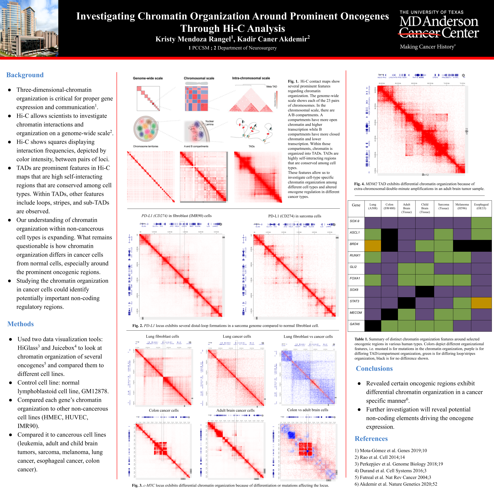

# Investigating Chromatin Organization Around Prominent Oncogenes Through Hi-C Analysis

This project was conducted during the Summer 2021 in the Akdemir lab at the Department of Neurosurgery at MD Anderson Cancer Center.

## Abstract

### Background

Three-dimensional-chromatin organization is critical for proper gene expression and communication. Chromosome Conformation Capture methods, such as Hi-C, allows scientists to investigate chromatin interactions and organization on a genome-wide scale. Hi-C contacts maps are then created to analyze chromatin interactions within cell types. Hi-C shows squares displaying interaction frequencies, depicted by color intensity, between pairs of loci. TADs are prominent features in Hi-C maps that are high self-interacting regions that are conserved among cell types. Within TADs, other features include loops, stripes, and sub-TADs. Although our understanding of chromatin organization within non-cancerous cell types is expanding substantially, what remains questionable is how chromatin organization differs in cancer cells from normal cells, especially around the prominent oncogenic regions. Therefore, studying the chromatin organization in cancer cells could identify potentially important non-coding regulatory regions.

### Methods

To investigate chromatin organization within normal and cancer cells, we used two main data visualization tools: HiGlass and Juicebox. We looked at the chromatin organization of several oncogenes genes such as c-MYC and STAT3 using these visualization browsers and compared them to different cell lines. Our control cell line was a normal lymphoblastoid cell line, GM12878. We compared each gene’s chromatin organization to other non-cancerous cell lines like HMEC, HUVEC, IMR90. We also compared it to cancerous cell lines representing such as leukemia, adult and child brain tumors, sarcoma, melanoma, lung cancer, esophageal cancer, and colon cancer types.

### Results

Analyzing the CD274 gene (PD-L1), differences in chromatin organization were observed between the GM12878 cell line and the sarcoma cell line. In sarcoma, the TAD in which CD274 is located has stripes that go beyond the CTCF-mediated loops meaning that the TAD may be having interactions with nearby loci. In sarcoma, the TAD also seems to be part of a bigger domain compared to the GM12878 cell line. Examining the Hi-C data of c-MYC gene, there were vast differences within all cancerous cell lines. Both the adult brain tumor cell line and colon cancer cell line show that c-MYC is being amplified and overexpressed potentially caused by a mutation. In child brain tumors, there seems to be less sub-TADs and has a much simpler chromatin organization.

### Conclusion

Our study revealed that certain oncogenic regions exhibit differential chromatin organization in a cancer specific manner. Further investigation of these altered chromatin organization will reveal potential non-coding elements driving the oncogene expression.

Keywords: 3D-chromatin organization, oncogenes, Hi-C

