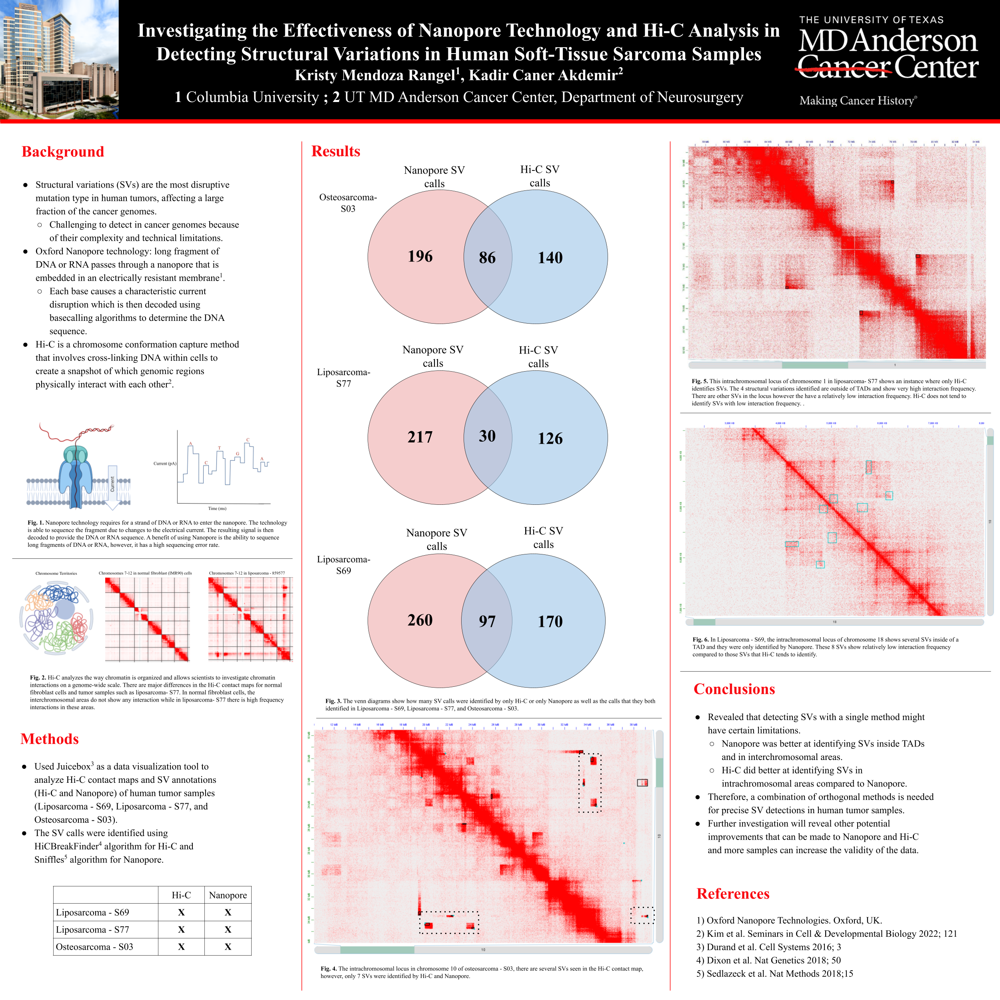

# Investigating the Effectiveness of Nanopore Technology and Hi-C Analysis in Detecting Structural Variations in Human Soft-Tissue Sarcoma Samples

This project was conducted during Summer 2022 in the Akdemir lab at the Department of Neurosurgery at MD Anderson Cancer Center.

# Abstract

## Background
	
Structural variations (SVs) are the most disruptive mutation type in human tumors, affecting the largest fraction of the cancer genomes. Currently, detecting SVs in cancer genomes is challenging due to technical limitations and complexity of SVs. In this study, we evaluated two cutting-edge genomic techniques for SV detection in human soft-tissue sarcoma samples. Our first method is Oxford Nanopore technology which relies on a single strand of DNA to pass through a small protein channel (a nanopore) that is embedded in an electrically resistant membrane. As the strand of DNA passes through the pore, each base causes a characteristic current disruption which is then decoded using basecalling algorithms to determine the DNA sequence. Our second method to examine genomic rearrangements is Hi-C, a chromosome conformation capture method. Hi-C involves cross-linking DNA within cells to create a snapshot of which genomic regions physically interact with each other. Hi-C has been identified as an intuitive method for recognizing structural variations due to the large insert size and the detection of spatial proximity near breakpoints. 

## Methods

To investigate structural variation calls identified by Hi-C (using HiCBreakFinder algorithm) and Nanopore (using Sniffles algorithm) in human tumor samples, we used a data visualization tool, Juicebox. We looked at Hi-C contact maps for osteosarcoma and 2 different liposarcoma tumor samples. We analyzed the efficiency of Hi-C and Nanopore and their ability to identify structural variations in cancer cells by comparing the SV call annotations to the Hi-C contact maps. We noted patterns observed about where Hi-C and Nanopore would identify structural variations and conclude their efficiency by estimating the amount of calls in a locus compared to the rearrangements seen in the Hi-C contact maps.

## Results

In general, Nanopore was proved to be better at identifying SVs inside TADs and in interchromosomal areas. Interchromosomal interactions are an indication of a rearrangement and a problem present in the chromatin organization of that cell. Hi-C did better at identifying SVs in intrachromosomal areas compared to Nanopore. Neither technologies were able to identify all of the genomic rearrangements.

## Conclusions

Our study revealed that detecting SVs with a single method might have certain limitations. Therefore, we conclude that a combination of orthogonal methods is needed for precise SV detections in human tumor samples.

Keywords: Hi-C, Nanopore sequencing, Structural variations
