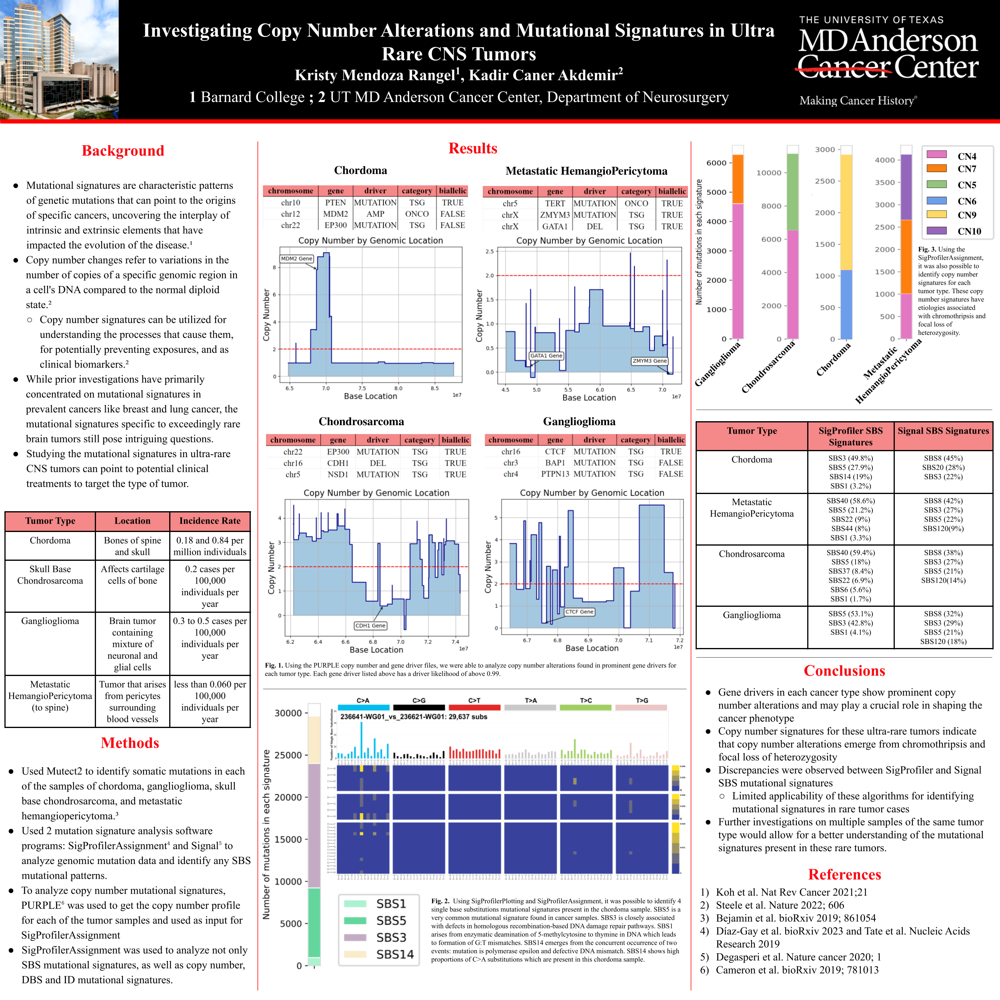

# Investigating Copy Number Alterations and Mutational Signatures in Ultra Rare CNS Tumors

This project was conducted during the Summer of 2023 in the Akdemir lab at the Department of Neurosurgery at MD Anderson Cancer Center.

## Abstract

### Background

Mutational signatures provide invaluable insights into the intricate genetic alterations driving distinct cancer types, shedding light on the interplay between intrinsic and extrinsic factors that govern disease evolution. Copy number alterations, involving changes in genomic copy numbers relative to the normal diploid state, play a pivotal role in this context. By examining copy number signatures, we gain a deeper comprehension of the underlying processes, potential preventive strategies, and the identification of clinical biomarkers. While previous research has predominantly focused on mutational signatures in prevalent cancers like breast and lung cancer, investigating mutational signatures in exceedingly rare brain tumors presents captivating inquiries. Exploring mutational signatures in ultra-rare central nervous system (CNS) tumors holds the key to unearthing vital insights that could pave the way for targeted clinical treatments tailored to these unique tumor types. By unlocking new therapeutic avenues, this research carries profound implications for the clinical management of rare brain tumors.

### Methods

Mutect2 was used to first identify somatic mutations in each tumor type: chordoma, skull base chondrosarcoma, ganglioglioma, and metastatic hemangiopericytoma. These files were used as the input to identify mutational signatures using two different algorithms: SigProfilerAssignment and Signal. Signal was able to identify single base substitutions (SBS) signatures for each tumor type. SigProfilerAssignment is more diverse and identifies single-base substitutions, double-base substitutions, indels, and copy number mutational signatures. To analyze copy number alterations in each of the tumors, PURPLE files were analyzed, and we identified gene drivers that have copy number changes that deviate from the normal.
	
### Results

In general, many driver genes are involved in copy number changes in all the tumor types in this investigation. For example, MDM2 is a driver gene with a driver likelihood of over 0.99 and showed a copy number gain in comparison with the rest of the gene location. Copy number signatures showed how chromothripsis and focal loss of heterozygosity are potential processes that can explain copy number alterations in these tumors. The mutational signatures identified by both algorithms exhibited partial discrepancies and did not align completely.

### Conclusion

Our study revealed that there is limited applicability of SigProfiler and Signal for identifying mutational signatures in rare tumor cases since they are more often used in more common cancers. Further explorations involving multiple samples of the same tumor type would facilitate a more comprehensive comprehension of the mutational signatures inherent in these rare tumors.

Keywords: Copy number alterations, Mutational signatures, Rare tumors

